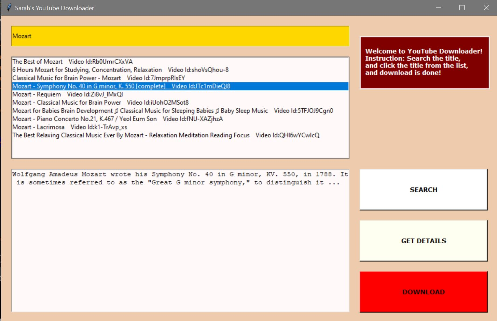

  
  <h1 align="center">YouTube Downloader</h1>
  

    This is a Python script where you can enter the name of video, and it downloads to your computer!

<!-- ABOUT THE PROJECT -->
## About The Project
<b> Work In Process</b>

### Built With

* Python
* Python - PyTube
* Python - YouTube API

<!-- GETTING STARTED -->
## The Process and What I have learned

### The Process

  I created this script because I wanted to download a few videos from YouTube.

### Lesson Learned

Finally, I added the new interface and improve the downloader. I first created this project a few months ago, so I didn't remember exactly how I started it, so it was a bit challenging to read my code again and see what I did there. 

Previously, I only used PyTube and scrape the title and video id to download the videos using the urllib library, but I found I could get more information about the video using the API, so I updated it.

  
Since the YouTube output data is in JSON format, I needed to break it down to get the right information. Also, I had a bit of a challenging time creating a nested dictionary. Also, there was an unexpected bug in PyTube, so I had to fix it accordingly.

  
In conclusion, now a user can search for any YouTube videos and select the video to download, instead of downloading the first video. 

